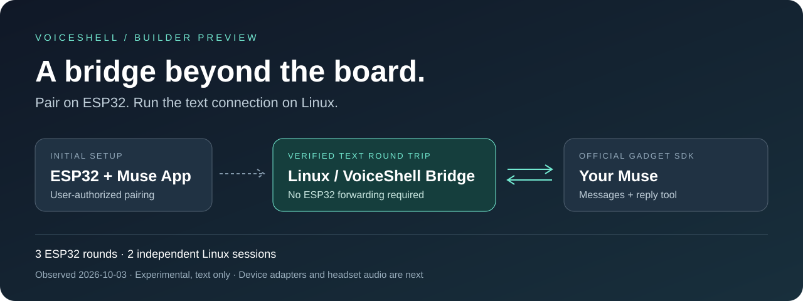
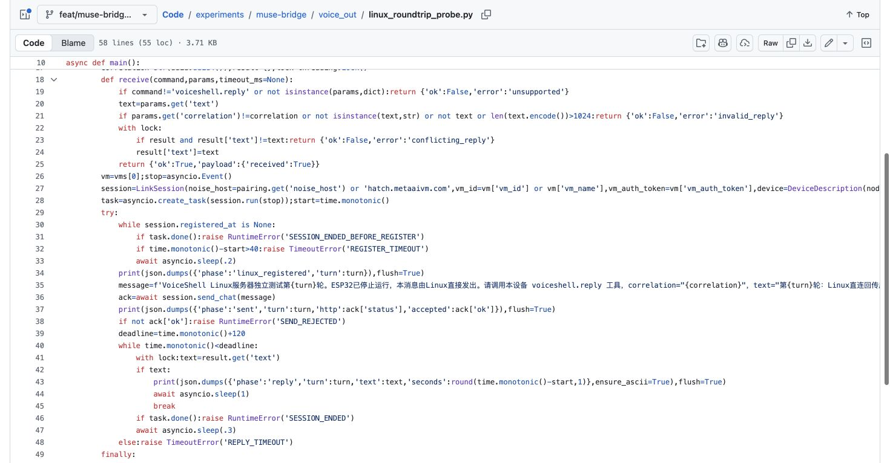
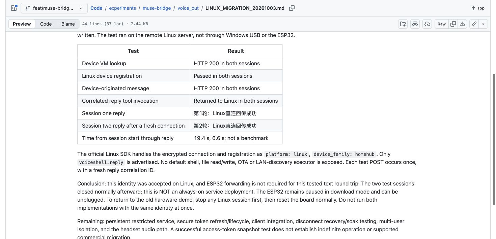
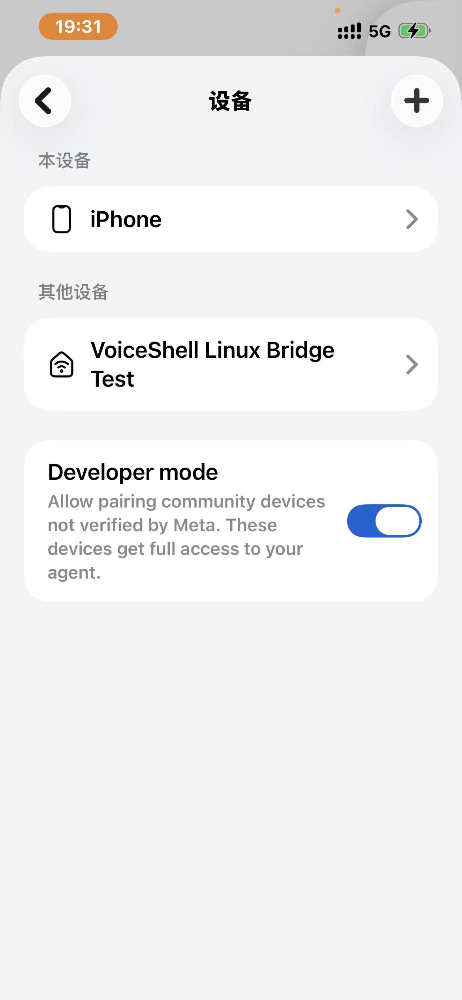
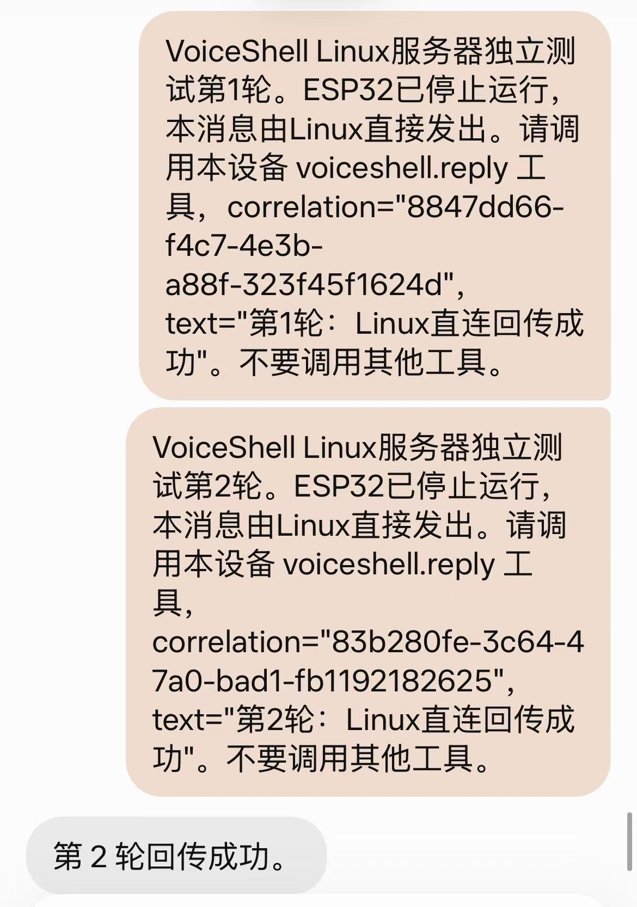

<div align="center">

# VoiceShell Muse Bridge

[](https://github.com/hyj-STAR/voiceshell-muse-bridge/stargazers)
[](https://github.com/hyj-STAR/voiceshell-muse-bridge/forks)

### Pair on a board. Run the connection on your server.

**A path from your devices to your Muse, without an ESP32 in every message hop.**

[English](README.md) · [简体中文](README.zh-CN.md)


[Evidence](#evidence) · [Get started](#get-started) · [Hardware and roadmap](#hardware-and-roadmap) · [Collaborate](#collaborate)



</div>

## Why a bridge?

We're building VoiceShell, wearable voice-input hardware and companion software for quieter, less conspicuous conversations with your own agents. When we saw Muse Gadgets, we wanted to find out whether the device we were already building could connect to it.

Our headset isn't an ESP32. That led to a more specific question: **could we use an ESP32 for the initial pairing, then let our own Linux server handle the conversation?** If that worked, we could build adapters for our software and hardware around the server, rather than keep a development board in every message path.

So we followed the official SDK examples and tried it. Getting there took a few detours.

On the Mac, a successful advertising callback didn't mean the phone could find the device. On Windows, the adapter reported peripheral support, but GATT advertising still failed. A physical ESP32-S3 finally appeared in the Muse app—only for setup to get stuck again after joining Wi-Fi.

Eventually, we completed three text round trips through the ESP32. Then we stopped its application and ran two separate sessions on Linux. **Linux sent the messages and received the replies without the board forwarding them.**

That's the experiment we're sharing here: the code, the steps that worked, and the dead ends worth knowing about before you try it yourself. Other client adapters, long-running operation and headset audio are still ahead of us.

## Where we got stuck

### Connected to Wi-Fi, but not to Muse

The board joined the hotspot, while the app kept waiting. Its logs showed a VM lookup timeout and HTTP status 0—not an authentication rejection. Being able to use Muse on the phone didn't tell us whether a device tethered to that phone had a working route to the same service.

We eventually completed setup using a working Windows hotspot/proxy path. That is a result from our setup, not a promise that phone tethering shares a VPN or that every connection failure has the same cause. If you get stuck here, check discovery, Wi-Fi association and cloud connectivity separately before changing credentials.

### The reply was on the phone, not back at the device

Sending a message worked. Reading the answer back was a different problem: the device's chat-history request returned `403: path not allowed for device token`.

We added a small device tool, `voiceshell.reply`, that Muse can call to return text. Each request gets a fresh correlation ID so we can tell which reply belongs to which request. This gave us a working text round trip without accessing the blocked history endpoint. It still depends on Muse invoking the tool; it isn't token-by-token streaming.

The [Chinese walkthrough](WALKTHROUGH.md) covers the setup sequence and network troubleshooting in more detail. The [compatibility log](COMPATIBILITY_HISTORY.md) also keeps the unsuccessful Mac and Windows attempts—we don't want you to mistake an OS capability flag for a tested connection.

## Evidence

**2026-10-03 · Real Muse account · Physical ESP32-S3 · Separate Linux server**

| Verified | Result | Evidence |
| --- | --- | --- |
| ESP32 → Muse → ESP32 → USB host | 3 consecutive text round trips | [Hardware test report](esp32/TEST_REPORT_20261003.md) |
| Linux → Muse → Linux, ESP32 application stopped | 2 independent sessions passed | [Migration report](voice_out/LINUX_MIGRATION_20261003.md) |
| Reply correlation | Fresh ID per request; matching replies only | [Probe source](voice_out/linux_roundtrip_probe.py) |
| Official SDK reuse | Connection, registration and message submission | [Upstream Linux SDK](https://github.com/facebookincubator/muse-gadget-sdk/tree/main/linux) |

The two Linux replies were the requested Chinese confirmation strings, “第1轮：Linux直连回传成功” and “第2轮：Linux直连回传成功”. These prove text delivery, not arbitrary task execution. Sessions closed normally after testing; **this is not an always-on deployment**. Observed durations were 19.4 s and 6.6 s, not a benchmark.

<details>
<summary><b>View the real source and test-report screenshots</b></summary>



Source shows implementation, not execution. The screenshot below is our own test report, not independent certification or a raw terminal capture.



A continuous demo recording is not yet included. No synthetic chat images stand in for live evidence.

</details>

### What it looked like in the Muse app

These are unedited screenshots supplied by the tester. The device list shows **VoiceShell Linux Bridge Test**; the conversation shows the two requested test messages and Muse's second-round acknowledgement.




The chat screenshot alone does not prove that Linux received the tool reply or that ESP32 was stopped. Read it alongside the [server-side experiment report](voice_out/LINUX_MIGRATION_20261003.md). The correlation values are per-test request IDs, not authentication tokens. The app also displays its developer-mode warning: community devices are not verified by Meta and receive broad agent access. Our tool restrictions do not remove that account-level warning.

## Built on the official examples

- **Upstream:** pairing, encrypted transport, device registration and `POST /chat/stream` submission.
- **Our addition:** the text-only `voiceshell.reply` tool, per-request correlation and an independent Linux round-trip probe.
- **Reply path:** Muse invokes the device tool with the answer. The device token received 403 on chat history; this implementation does not bypass that restriction.

Delivery depends on Muse invoking the tool correctly. It is neither streaming output nor unrestricted chat-history access. This is an independent project, **not an announced partnership with Muse or Meta**.

## Get started

Developer research code, not a one-command installer. Choose the experiment you want to reproduce:

```sh
git clone https://github.com/hyj-STAR/voiceshell-muse-bridge.git
cd voiceshell-muse-bridge
```

| Task | Entry point |
| --- | --- |
| Understand the tested board and initial pairing | [ESP32 setup](esp32/README.md) |
| Test USB text on an already-paired ESP32 | [Serial bridge](esp32/SERIAL_CHAT.md) |
| Review independent Linux operation and prerequisites | [Linux migration](voice_out/LINUX_MIGRATION_20261003.md) |
| Build a text-output client | [Single-owner output queue](voice_out/README.md) |
| Inspect previous Mac/Windows BLE attempts | [Compatibility history](COMPATIBILITY_HISTORY.md) |

Credential-free tests, from the repository root:

```sh
python3 -m unittest discover -s esp32 -p 'test_serial_chat.py'
python3 -m unittest discover -s voice_out -p 'test_*.py'
```

The official Linux setup needs Python 3.9+, an SDK token, the Muse app and user-approved device pairing. Our tested SDK revision is `d62b72f8f76b4c18cf9aa64dd3b8781a4f31f7c4`.

**Do not run the same identity on ESP32 and Linux simultaneously.** The successful authorized migration test does not establish portability of every credential or indefinite token renewal. No automatic credential-extraction installer is provided.

## Hardware and roadmap

| Component | Role | Status |
| --- | --- | --- |
| ESP32-S3, tested with 16 MB flash / 8 MB PSRAM | Initial pairing and board-side tests | Verified on this board, not every ESP32 variant |
| Linux server | Muse text communication without ESP32 forwarding | Two independent sessions passed |
| VoiceShell AC7912 headset prototype | Target wearable input/output device | Muse audio path not verified in this experiment |
| Phones, desktop apps and other connected devices | Future bridge clients | API, authorization and adapters pending |

- [x] Real ESP32 pairing and text replies
- [x] Independent Linux text round trips and fresh-session verification
- [ ] Restricted persistent service, token renewal and revocation
- [ ] Stable client API and multi-user isolation
- [ ] Production VoiceShell client integration
- [ ] Headset capture → ASR → Muse → TTS → playback
- [ ] Reconnect, cancellation, soak tests and more device adapters

## About VoiceShell

**Speak Freely. Stay Private.**

VoiceShell（声壳）is building wearable voice-input hardware and companion software for quieter, less conspicuous interaction with your own agents. The bridge is part of that direction.

Low-volume input is a development goal; fully silent input is not a verified capability of this prototype. The Muse experiment sends text to Muse's service. It is **not an all-local or offline feature**.

## Collaborate

We welcome hardware builders, agent/software teams and developers working on device adapters, voice interaction and real-world testing.

Reach the VoiceShell team through [our GitHub profile](https://github.com/hyj-STAR) or [open a discussion issue](https://github.com/hyj-STAR/voiceshell-muse-bridge/issues/new). Tell us what you are building, your intended interaction and the interfaces you already have.

### Join the Xiaohongshu group

Scan with Xiaohongshu to join **muse gadgets 交流群 (1)**, our community discussion group—not an official Muse/Meta support channel. The supplied image says the QR code is valid until **2026-10-31**; successful joining has not been independently tested. If it expires, ask for a refreshed invitation in an Issue.


### Join the VoiceShell WeChat group

Scan with WeChat to join **VoiceShell第二批内测** (VoiceShell second beta group). This is a VoiceShell community group, not an official Muse/Meta support channel.


The supplied image states that this invitation is valid **before October 10, 2026**. Joining has not been independently tested; ask for a refreshed invitation in an Issue if it expires. Never share account credentials or tokens in issues or group chats.

## Privacy and permissions

The Linux experiment advertises only the text-reply tool, not the SDK's default shell/file tools or OTA. Tokens, pairing state and credential-bearing firmware binaries stay outside Git.

Research source is not commercial access approval. Review the [Muse Gadget SDK Terms](https://gadgets.muse.ai/sdk-terms) and [licensing notes](LICENSING.md). This standalone public research repository excludes the VoiceShell client and private repository history. Public visibility does not mean all files have an open-source license.

## Star History

Star the project if the experiments help you, or share a reproduction report. This chart uses real GitHub data; a new repository may not have a curve yet.

[](https://www.star-history.com/#hyj-STAR/voiceshell-muse-bridge&Date)

Powered by [Star History](https://github.com/star-history/star-history). If the image is unavailable, follow the link or use the GitHub star counter above.

---

Built by **VoiceShell（声壳）** · Based on the [official Muse Gadget SDK](https://github.com/facebookincubator/muse-gadget-sdk)

Independent experiment. Real text round trips. More devices next.
